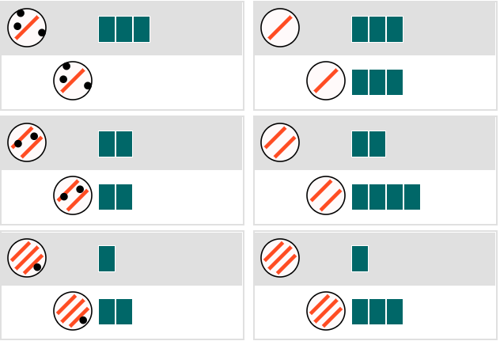

```{r packages, include=FALSE}
library(dplyr)
library(tidyr)
library(stringr)
library(ggplot2)
library(patchwork)
library(knitr)
library(googlesheets4)
```

```{r data, include=FALSE}
load('data/pilot_1_cleaned.rdata')
# Label data
labels = read_sheet("https://docs.google.com/spreadsheets/d/1xmfK-JrVznHkPfKPoicelXOW5Mj252G2TtY6O9PP2tM/edit#gid=1386715201")
labels = labels  %>%
  mutate(condition=case_when(condition=='comp_const'~'combine', 
                   condition=='comp_mult'~'construct', 
                   condition=='comp_mult_reverse'~'discern'))

```


# Experiment

## Materials

In this experiment we have:

- Agent object properties: number of stripes and dots (randomly positioned).
- Recipient object properties: number of blocks.
- Result object properties: number of blocks.
- Animation: an agent object moves towards a recipient object, and the recipient object changes into the result form by varying its original number of blocks.
- **Ground-truth** rule is a mixture of multiplication and subtraction: `Blocks(R') <- Stripes(A) * Blocks(R) - Dots(A)`.

And three **learning conditions**:

1. `Construct`: First build the `Stripes(A) * Blocks(R)` sub-part, and then re-use it to build the ground truth rule
  

2. `Discern`: reverse order of the `construct` condition
  

3. `Combine`: First build the `Stripes(A) * Blocks(R)` sub-part, and then build the `- Dots(A)` sub-part
  


**Generalization trials** are picked by a mixture of novelty & EIG re. potential causal rules.
Their orders were randomized for every participant.

*  


## Procedure

Each participant is randomly assigned to one of the three learning conditions. After reading instructions and passing a comprehension quiz, they first watched three learning examples, and then were asked to write down their guesses about the underlying causal relationships & made generalization predictions for eight pairs of novel objects. 
After that, they watched another three learning examples, and then wrote down an updated guess and made 8 generalization predictions. 
The pairs of generalization objects in both phases are the same, but their presentation orders were randomized.
All learning examples were remained in the screen once they had appeared.
Generalization trials appeared sequentially, and once a prediction was made the trial was replaced by the next one.

Try it here: <https://eco.ppls.ed.ac.uk/bn_comp/>


# Pilot results


Recruited N = 20 participants on Prolific (age = `r round(mean(df.sw$age))` ± `r round(sd(df.sw$age),1)`). 

Mean time spent `r round(mean(df.sw$instructions_duration+df.sw$task_duration)/60000,2)` minutes.

Base payment is £1.20, 
and bonus are paid for both free-responses (£0.20 per input, 2 inputs in total) and generalization predictions (£0.05 per correct one with respect to ground-truth).


```{r condition_sum, echo=FALSE}
overview = df.sw %>% 
  group_by(condition) %>%
  summarise(n=n(), 
            age=round(mean(age)),
            intro_time=round(mean(instructions_duration)/60000,2),
            task_time=round(mean(task_duration)/60000,2), 
            difficulty=round(mean(difficulty),2),
            engagement=round(mean(engagement),2)
            )
kable(overview, caption = 'Overview (cells are mean values, time in minutes, difficulty & engagement scales are 1-10)')
```


## Task difficulty

Participants in the `discern` condition took the longest time to finish the task, and reported the highest self-evaluated difficulty as well. Participants in the other two conditions, where sub-parts were built before seeing complex examples, took less time to finish the task and reported lower difficulty evaluations.


```{r condition_plot, echo=FALSE}
sum_data=df.sw %>% 
  group_by(condition) %>%
  summarise(task_time=mean(task_duration)/60000, 
            difficulty=mean(difficulty)) %>%
  ungroup()
  
ggplot(sum_data, aes(x=condition)) +
  geom_bar(aes(y=task_time), stat='identity', fill='#69b3a2') +
  geom_line(aes(y=difficulty, group=1), linetype='dashed') +
  geom_point(aes(y=difficulty), size=2) +
  scale_y_continuous(
    name='Minutes',
    sec.axis=sec_axis(~./1.2, name='Scales (10=very hard)')
  ) +
  labs(x='', title = 'Average task time (bars) and self-evaluated difficulty (dots)') +
  theme_bw()

```


## Free responses

Below are plots of the change in the free response guesses in Learning phase A and Learning phase B.

For the `construct` condition (green line), certainty was very high in Learning phase A (when dots are set to 0), and dropped after Learning phase B. The length of texts stayed roughly the same.

For the other two conditions, certainty was low in Learning phase A, and increased after watching the second batch of examples. Accordingly, text inputs were lengthy in Learning phase A, indicating more rambling and guessing, and became a lot more succinct in Learning phase B. This trend is especially clear for the `discern` condition. 


```{r phases, echo=FALSE}
sum_phase=df.sw %>%
  mutate(len_a=str_length(input_a), len_b=str_length(input_b)) %>%
  group_by(condition) %>%
  summarise(certainty_a=mean(certainty_a), certainty_b=mean(certainty_b),
            input_a_length=mean(len_a), input_b_length=mean(len_b))

cert <- sum_phase %>%
  gather(measure, value, certainty_a, certainty_b, input_a_length, input_b_length) %>%
  filter(substr(measure,1,1)=='c') %>%
  mutate(measure=toupper(substr(measure, 11, 11))) %>%
  ggplot(aes(x=measure,y=value,group=condition)) +
  geom_line(aes(color=condition),linetype="dashed", size=1.2) +
  geom_point(aes(color=condition, shape=condition), size=3.5) +
  labs(x='', y='', title='Certainty') +
  theme_bw()

len <- sum_phase %>%
  gather(measure, value, certainty_a, certainty_b, input_a_length, input_b_length) %>%
  filter(substr(measure,1,1)=='i') %>%
  mutate(measure=toupper(substr(measure, 7, 7))) %>%
  ggplot(aes(x=measure,y=value,group=condition)) +
  geom_line(aes(color=condition),linetype="dashed", size=1.2) +
  geom_point(aes(color=condition, shape=condition), size=3.5) +
  labs(x='', y='', title='Input length (nchar)') +
  theme_bw()

combined = cert + len & theme(legend.position = "bottom")
combined + plot_layout(guides = "collect")
```


Looking closely into these free responses:

**The `construct` condition**:

- 4 out of 6 participants reported the same as our normative model (build a `multiplication` sub-part, and then add `subtraction` to it)
- 1 participant's report is as the loosened model (allow up to 2 exceptions)
- 1 participant got it completely wrong
  


**The `discern` condition**:

After the initial learning phase:

- 3 out of 7 participants reported a rule that is conditional on the relations between dots and stripes: "If there are more dots than stripes the length decreases. If there are more stripes than dots the length increases. If these are both the same, the length remains the same." 
- 1 participant reported a similar conditional rule but it's conditional on the number of stripes: "I guess that 1 line means take away ... 2 lines mean equal ... 3 lines means add (with the dot representing how many segments to add)".
- 1 person worked out the ground truth. 
- 2 participants were just lost.


After the second learning phase:

- 5 participants reported the correct multiplication sub-parts, in addition to that 1 person who already worked out the ground truth after the first attempt. 
- 1 participant is still in the "if-else" mindset and compared stripes and blocks in the report.
  


**The `combine` condition**:

- In learning phase A, 4 out of 7 participants got the multiplication sub-parts, and the remaining 3 reported the loosened model's predicted rule
- In learning phase B, 6 out of 7 participants got the subtraction sub-parts, 1 was lost. 1 participants particularly mentioned that it wasn't clear how this subtraction rule is related with the multiplication rule.


## Learning accuracy

In all three conditions, prediction accuracy (according to strict comparison with ground truth) increased after seeing more examples. 
Nevertheless, participants in the `construct` condition got the most predictions correct.

As for self-reports, accuracy in the `construct` condition stays with same, while the other two shows improvement. 
In Learning phase B, participants in the `combine` condition shows highest accuracy in their self-reports, while their prediction accuracy is worse than the `construct` condition. This indicates that getting the correct sub-parts are not enough for making generalization predictions - how to combine them also matters.


```{r accuracy, echo=FALSE, message=FALSE}
pred_acc = df.tw %>%
  group_by(batch, condition) %>%
  summarise(acc=sum(correct)/n()) %>%
  ggplot(aes(x=batch,y=acc,group=condition)) +
  geom_line(aes(color=condition),linetype="dashed", size=1.2) +
  geom_point(aes(color=condition, shape=condition), size=3.5) +
  labs(x='', y='', title='Prediction accuracy (strict)') +
  ylim(0,0.75) +
  theme_bw()


report_acc = labels %>%
  select(ix, condition, input_a_correct, input_b_correct) %>%
  gather(phase, correct, input_a_correct, input_b_correct) %>%
  mutate(phase=toupper(substr(phase,7,7))) %>%
  group_by(condition, phase) %>%
  summarise(acc=sum(correct)/n()) %>%
  ggplot(aes(x=phase, y=acc, group=condition)) +
  geom_line(aes(color=condition),linetype="dashed", size=1.2) +
  geom_point(aes(color=condition, shape=condition), size=3.5) +
  labs(x='', y='', title='Self-report accuracy') +
  ylim(0,0.75) +
  theme_bw()

acc_combined = pred_acc + report_acc & theme(legend.position = "bottom")
acc_combined + plot_layout(guides = "collect")

```


## Generalization biases

In trial 7, agent object has 4 stripes and no dots - a near transfer to those in the learning examples. It turns out generalization accuracy for this trial is high for both the `construct` and `combine` conditions, with no significant difference between learning phase A and B. However, its accuracy improved a lot for the `discern` condition.


For trials 1, 2, and 3, agent objects have no stripes - a striking difference to learning examples. Generalization accuracy showed similar trend as compared with trial 7, with the overall accuracy values lower for all three conditions as compared to trial 7.


For trials 4, 5, 6, and 8, agent objects have non-zero stripes and non-zero dots. For conditions `construct` and `combine`, these objects are strikingly different after learning phase A, but less different after learning phase B. We observe a clear rising trend in generalization accuracy for all three conditions.


Putting together, it seems that when learning sub-parts separately (conditions `construct` and `combine`), participants' prior beliefs about the unseen feature are less likely to mess up with the learned bit.


```{r trials, echo=FALSE, message=FALSE}
t7 = df.tw %>% 
  filter(trial==7) %>%
  select(ix, condition, batch, correct) %>%
  group_by(condition, batch) %>%
  summarise(percent_correct=sum(correct)/n()*100) %>%
  ggplot(aes(x=batch, y=percent_correct, group=condition)) +
  geom_line(aes(color=condition),linetype="dashed", size=1.2) +
  geom_point(aes(color=condition, shape=condition), size=3.5) +
  labs(x='', y='Percent correct', title='4 stripes & 0 dots') +
  ylim(0,100) +
  theme_bw()


t3 = df.tw %>% 
  filter(dot==0) %>%
  select(ix, condition, batch, correct) %>%
  group_by(condition, batch) %>%
  summarise(percent_correct=sum(correct)/n()*100) %>%
  ggplot(aes(x=batch, y=percent_correct, group=condition)) +
  geom_line(aes(color=condition),linetype="dashed", size=1.2) +
  geom_point(aes(color=condition, shape=condition), size=3.5) +
  labs(x='', y='Percent correct', title='0 stripes') +
  ylim(0,100) +
  theme_bw()

t4 = df.tw %>%
  filter(dot > 0 & stripe > 0) %>%
  select(ix, condition, batch, correct) %>%
  group_by(condition, batch) %>%
  summarise(percent_correct=sum(correct)/n()*100) %>%
  ggplot(aes(x=batch, y=percent_correct, group=condition)) +
  geom_line(aes(color=condition),linetype="dashed", size=1.2) +
  geom_point(aes(color=condition, shape=condition), size=3.5) +
  labs(x='', y='Percent correct', title='Stripes > 0, dots > 0') +
  ylim(0,100) +
  theme_bw()

tt_combined = t7 + t3 + t4 & theme(legend.position = "bottom")
tt_combined + plot_layout(guides = "collect")

```


I also checked the percentage of predictions that are explained by the multiplication sub-part only in learning phase A.

Indeed, in the `construct` condition, more than half of the generalization predictions in phase A are explained by the multiplication rule only, indicating that these people might just ignore the dot features when first seeing them.
It is strange that the `combine` condition shows a way lower value, considering that in phase A participants in these two conditions should have seen exactly the same learning examples.

Unsurprisingly, non of the predictions in phase A in the `discern` condition can be explained by the multiplication rule.


```{r partial, echo=FALSE, message=FALSE}
df.tw %>%
  filter(batch=='A' & dot > 0 & stripe > 0 & correct==0) %>%
  mutate(partial_correct=(prediction==stripe*block)) %>%
  group_by(condition) %>%
  summarise(ignore_dots=sum(partial_correct)/n()*100) %>%
  ggplot(aes(x=condition, y=ignore_dots)) +
  geom_bar(position='dodge', stat='identity', fill='#69b3a2') +
  ylim(0, 100) +
  labs(x='', y='percent', title='Trial 4,5,6,8, phase A predictions explained by mult rule') +
  theme_bw()

```


