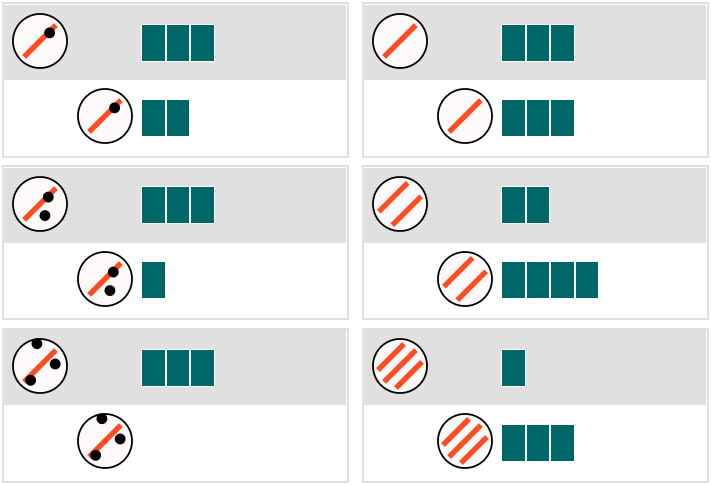

# Experiments overview

Participants had to learn a causal relationship between features of a causal agent (magic egg, the egg) and changes in a causal recipient (a block of segments, sticks) based on several examples in which the two objects interacted. In each example, by clicking a ''test'' button, the agent moves toward the recipient, and the recipient changes into its result form. 

See Appendix for a summary of the stimuli.

# Ground truths and alternatives

| Exp. | Ground truth                             | Alternative                                |
|------|------------------------------------------|--------------------------------------------|
|    1 | stripe(egg) * segment(block) - spot(egg) | stripe(egg) * (segment(block) - spot(egg)) |
|    2 | spot(egg) * segment(block) - stripe(egg) | spot(egg) * (segment(block) - stripe(egg)) |
|    3 | stripe(egg) * segment(block) - spot(egg) | stripe(egg) * (segment(block) - spot(egg)) |
|    4 | spot(egg) * segment(block) - stripe(egg) | spot(egg) * (segment(block) - stripe(egg)) |

# Types of responses

| Type         | Definition                                                                                     | Examples                                                                                                                                             |
|--------------|------------------------------------------------------------------------------------------------|------------------------------------------------------------------------------------------------------------------------------------------------------|
| Ground_truth | equivalent to the ground truth causal relation in each experiment                              | the length is multiplied by the number of lines and then the number of dots is subtracted                                                            |
| Alternative  | equivalent to the alternative causal relation in each experiment                               | the dots subtract from the segments by their number, and the number of lines is multiplied by the amount of segments                                 |
| Comp         | unclear or implicit about how two sub causal concepts should be combined                       | the lines multiply the segments and the dots subtract the segments.                                                                                  |
| Add_2        | add two segments to the recipient                                                              | adds 2 segments to the stick only if there are 2 or more stripes on the egg                                                                          |
| Mult         | one feature of the agent object multiplies the recipient object                                | the number of stripes multiplies the number of segments                                                                                              |
| Subtraction  | one feature of the agent object is a subtractor to the recipient object                        | each spot on the egg takes away one stick                                                                                                            |
| Complex      | describe the stimuli without generalizing a rule, report a different rule for each observation | 3 dots means the sticks disappear, 2 dots means 2 sticks, 1 dot means add another stick; if there are more lines than dots it will increase in size. |
|              |                                                                                                | if there are more dots than lines it will decrease in size. an equal number of dots and lines will results in no change                              |
| Uncertain    | not knowing, unsure, or confused about the learning stimuli                                    | i dont have a clue!                                                                                                                                  |

# Appendix: Experiment stimuli

## Experiment 1

**Construct**: First build the `Stripes(A) * Blocks(R)` sub-part, and then re-use it to build the ground truth rule
  

**Deconstruct**: reverse order of the `construct` condition
  

**Combine**: First build the `Stripes(A) * Blocks(R)` sub-part, and then build the `- Dots(A)` sub-part
  

## Experiment 2

Feature counter-balancing of Exp. 1

**Construct**: First build the `Spots(A) * Blocks(R)` sub-part, and then re-use it to build the ground truth rule
  

**Deconstruct**: reverse order of the `construct` condition
  

**Combine**: First build the `Spots(A) * Blocks(R)` sub-part, and then build the `- Stripes(A)` sub-part
  

## Experiment 3

**Combine**: First build the `Stripes(A) * Blocks(R)` sub-part, and then build the `- Dots(A)` sub-part
  
  
**Flip**: reverse order of the `combine` condition
  

## Experiment 4

Feature counter-balancing of Exp. 3

**Combine**: First build the `Stripes(A) * Blocks(R)` sub-part, and then build the `- Dots(A)` sub-part
  

**Flip**: reverse order of the `combine` condition
  

