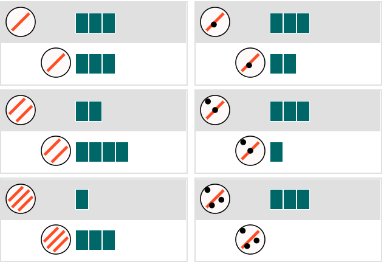

```{r packages, include=FALSE}
library(dplyr)
library(tidyr)
library(stringr)
library(ggplot2)
library(patchwork)
library(knitr)
library(googlesheets4)
library(ggridges)
```

```{r data, include=FALSE}
load('../../data/exp_3_cleaned.rdata')
load('../../data/exp_3_coded.Rdata')
```

# Experiment

## Materials

In this experiment we have:

- Agent object properties: number of stripes and dots (randomly positioned).
- Recipient object properties: number of blocks.
- Result object properties: number of blocks.
- Animation: an agent object moves towards a recipient object, and the recipient object changes into the result form by varying its original number of blocks.
- **Ground-truth** rule is a mixture of multiplication and subtraction: `Blocks(R') <- Stripes(A) * Blocks(R) - Dots(A)`.

And two **learning conditions**:

1. `Combine`: First build the `Stripes(A) * Blocks(R)` sub-part, and then re-use it to build `Stripes(A) * Blocks(R) - Dots(A)`. This is identical to the `combine` condition in Experiment 1.

  
  
2. `Flip`: reverse order of the `Combine` condition. An adapter grammar model will first build the `Dots(A) - Blocks(R)` sub-part, and then re-use it to build `Stripes(A) * (Blocks(R) - Dots(A))`. 

  
  
**Generalization trials** are the same as in Experiment 1.

 

  
## Procedure

Each participant is randomly assigned to one of the two learning conditions. After reading instructions and passing a comprehension quiz, they first watched three learning examples, and then were asked to write down their guesses about the underlying causal relationships & made generalization predictions for eight pairs of novel objects. 
After that, they watched another three learning examples, and then wrote down an updated guess and made 8 generalization predictions. 
The pairs of generalization objects in both phases are the same, but their presentation orders were randomized.
All learning examples were remained in the screen once they had appeared.
Generalization trials appeared sequentially, and once a prediction was made the trial was replaced by the next one.

<!-- Try it here: <https://eco.ppls.ed.ac.uk/bn_comp/> -->

<!-- Pre-registration: <https://osf.io/ud7jc> -->


# Results

Recruited N = 110 participants on Prolific (age = `r round(mean(df.sw$age))` ± `r round(sd(df.sw$age),1)`). 

Mean time spent `r round(mean(df.sw$instructions_duration+df.sw$task_duration)/60000,2)` minutes.

Base payment is £1.25, 
and bonus are paid for both free-responses (£0.20 per input, 2 inputs in total) and generalization predictions (£0.02 per correct one with respect to ground-truth).


```{r condition_sum, echo=FALSE}
overview = df.sw %>% 
  group_by(condition) %>%
  summarise(n=n(), 
            age=round(mean(age)),
            intro_time=round(mean(instructions_duration)/60000,2),
            task_time=round(mean(task_duration)/60000,2), 
            difficulty=round(mean(difficulty),2),
            engagement=round(mean(engagement),2)
            )
kable(overview, caption = 'Overview (cells are mean values, time in minutes, difficulty & engagement scales are 1-10)')
```


## Task difficulty

Participants in the `flip` condition took slighter longer time and reported higher self-evaluated difficulty, but these measures are not significant (t-test).


```{r condition_plot, echo=FALSE}
sum_data=df.sw %>% 
  group_by(condition) %>%
  summarise(task_time=mean(task_duration)/60000, 
            difficulty=mean(difficulty)) %>%
  ungroup()
  
ggplot(sum_data, aes(x=condition)) +
  geom_bar(aes(y=task_time), stat='identity', fill='#69b3a2') +
  geom_line(aes(y=difficulty, group=1), linetype='dashed') +
  geom_point(aes(y=difficulty), size=2) +
  scale_y_continuous(
    name='Minutes',
    sec.axis=sec_axis(~./1.2, name='Scales (10=very hard)')
  ) +
  labs(x='', title = 'Average task completion time (bars) and self-evaluated difficulty (dots)') +
  theme_bw()

# t.test(
#   filter(df.sw, condition=='combine') %>% pull(task_duration),
#   filter(df.sw, condition=='flip') %>% pull(task_duration),
#   paired = FALSE
# )

# t.test(
#   filter(df.sw, condition=='combine') %>% pull(difficulty),
#   filter(df.sw, condition=='flip') %>% pull(difficulty),
#   paired = FALSE
# )

```


## Self-reports

Participants in the "deconstruct" condition have lowest self-report certainty, and they also tried to write more elaborated guesses. Overall it looks like a negative relationship between certainty and input length.

```{r phases, echo=FALSE}
sum_phase=df.sw %>%
  mutate(len_a=str_length(input_a), len_b=str_length(input_b)) %>%
  group_by(condition) %>%
  summarise(certainty_a=mean(certainty_a), certainty_b=mean(certainty_b),
            input_a_length=mean(len_a), input_b_length=mean(len_b))

cert <- sum_phase %>%
  gather(measure, value, certainty_a, certainty_b, input_a_length, input_b_length) %>%
  filter(substr(measure,1,1)=='c') %>%
  mutate(measure=toupper(substr(measure, 11, 11))) %>%
  ggplot(aes(x=measure,y=value,group=condition)) +
  geom_line(aes(color=condition),linetype="dashed", size=1.2) +
  geom_point(aes(color=condition, shape=condition), size=3.5) +
  labs(x='', y='', title='Certainty') +
  theme_bw()

len <- sum_phase %>%
  gather(measure, value, certainty_a, certainty_b, input_a_length, input_b_length) %>%
  filter(substr(measure,1,1)=='i') %>%
  mutate(measure=toupper(substr(measure, 7, 7))) %>%
  ggplot(aes(x=measure,y=value,group=condition)) +
  geom_line(aes(color=condition),linetype="dashed", size=1.2) +
  geom_point(aes(color=condition, shape=condition), size=3.5) +
  labs(x='', y='', title='Input length (nchar)') +
  theme_bw()

combined = cert + len & theme(legend.position = "bottom")
combined + plot_layout(guides = "collect")

```  
  

<!-- ## Labels -->

<!--  -->


## Rules

Define three generalization rule types:

* `match_rule_1`: `(stripe*block)-dot`
* `match_rule_2`: `stripe*(block-dot)`
* `other`

A participant's generalization falls in `match_rule_1` or `match_rule_2` if >90% predictions are in line with that model's prediction.

It turns out that regardless of curriculum, participants have a strong preference of "adding" two pieces together. 


```{r rules, echo=FALSE, message=FALSE, warning=FALSE, fig.width=8, fig.height=6}
rule_match = df.tw %>%
  filter(batch=='B') %>%
  mutate(
    rule_1=stripe*block-dot,
    rule_2=stripe*(block-dot),
  ) %>%
  mutate(
    rule_1=if_else(rule_1<0, 0, rule_1),
    rule_2=if_else(rule_2<0, 0, rule_2),
  ) %>%
  mutate(
    match_rule_1=(prediction==rule_1),
    match_rule_2=(prediction==rule_2),
  ) %>%
  group_by(condition, ix) %>%
  summarise(match_rule_1=sum(match_rule_1), match_rule_2=sum(match_rule_2)) %>%
  mutate(rule=case_when(
    match_rule_1>=7 ~ 'match_rule_1',
    match_rule_2>= 7 ~ 'match_rule_2',
    TRUE ~ 'other'
  )) %>%
  mutate(is_rule_1=(rule=='match_rule_1'))

rule_match %>%
  group_by(condition) %>%
  count(rule) %>%
  mutate(rule=factor(rule, levels=c('match_rule_1', 'match_rule_2', 'other'))) %>%
  ggplot(aes(x=condition, y=n, fill=rule)) +
  geom_bar(stat='identity', position='fill') +
  theme_bw() +
  labs(x='', y='', title='Phase B decision type')

t.test(
  rule_match %>% filter(condition=='combine') %>% pull(is_rule_1),
  rule_match %>% filter(condition=='flip') %>% pull(is_rule_1),
)

# df.tw %>%
#   filter(batch=='B') %>%
#   mutate(
#     model_rule=if_else(condition=='combine', stripe*block-dot, stripe*(block-dot)),
#     alt_rule=if_else(condition=='flip', stripe*block-dot, stripe*(block-dot))
#   ) %>%
#   mutate(
#     model_rule=if_else(model_rule<0, 0, model_rule),
#     alt_rule=if_else(alt_rule<0, 0, alt_rule),
#   ) %>%
#   mutate(
#     model_match=(prediction==model_rule),
#     alt_match=(prediction==alt_rule)
#   ) %>%
#   group_by(condition, ix) %>%
#   summarise(model_match=sum(model_match), alt_match=sum(alt_match)) %>%
#   mutate(rule=case_when(
#     model_match>=7 ~ 'model',
#     alt_match>= 7 ~ 'alt',
#     TRUE ~ 'other'
#   )) %>%
#   group_by(condition) %>%
#   count(rule) %>%
#   mutate(rule=factor(rule, levels=c('model', 'alt', 'other'))) %>%
#   ggplot(aes(x=condition, y=n, fill=rule)) +
#   geom_bar(stat='identity', position='fill') +
#   theme_bw() +
#   labs(x='', y='', title='Phase B decision type')


```


  