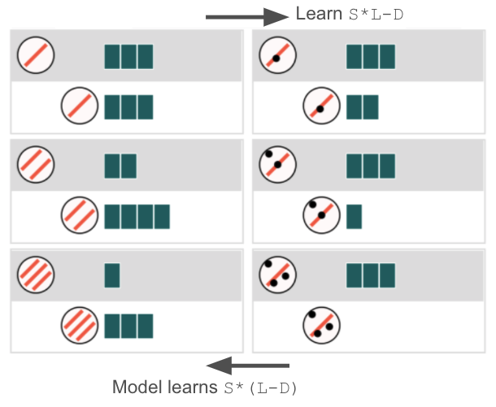
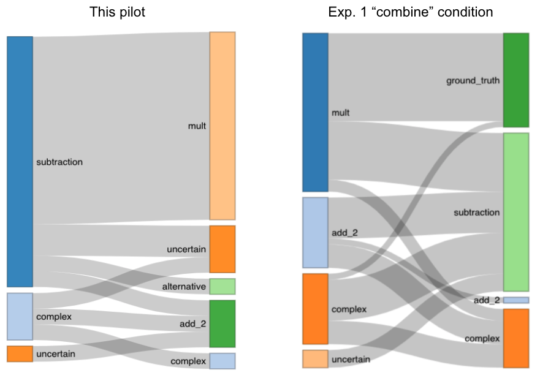

```{r setup, include=FALSE}
knitr::opts_chunk$set(echo = TRUE)
```

```{r packages, include=FALSE}
library(dplyr)
library(tidyverse)
library(ggplot2)

```

```{r data, include=FALSE}
# Load pilot data
load('../../data/pilot_2_cleaned.rdata')
pilot2.sw = df.sw
pilot2.tw = df.tw
pilot2.labels = labels

# Sample 20 ppl from Experiment 1 "combine" condition
load('../../data/exp_1_cleaned.rdata')
exp1.sw = df.sw
exp1.tw = df.tw
exp1_combine_ixs =exp1.tw %>%
  filter(condition=='combine') %>%
  pull(ix) %>%
  unique()
exp1_combine_ixs_sample = sample(exp1_combine_ixs, 20)
exp1.tsamples = exp1.tw %>%
  filter(ix %in% exp1_combine_ixs_sample)
# Add alternative truth info
exp1.tsamples = exp1.tsamples %>%
  mutate(alt=stripe*(block-dot)) %>%
  mutate(alt=if_else(alt<0, 0, alt)) %>%
  mutate(gt_correct=correct, alt_correct=as.numeric(prediction==alt)) %>%
  select(-correct, -alt)

```


# Experiment

Pilot on Prolific, N=20 (age = `r round(mean(df.sw$age))` ± `r round(sd(df.sw$age),1)`).
Mean time spent `r round(mean(df.sw$instructions_duration+df.sw$task_duration)/60000,2)` minutes.




# Self-report labels

No one reported the model ground truth - as people tend to report just the multiplication sub-parts in learning phase B. In contrast, in Experiment 1 "combine" condition, about one third of people used phrases like "and then", "on top of that" to report the model ground truth.




# Generalization accuracy

It seems that regardless of the curriculum, people tend to compose `(S*L)-D`:

```{r acc, echo=FALSE}
rbind(pilot2.tw, exp1.tsamples) %>%
  filter(batch=='B') %>%
  group_by(condition) %>%
  summarise(gt_correct=sum(gt_correct), alt_correct=sum(alt_correct), total=n()) %>%
  mutate(model_gt=round(100*gt_correct/total,2), alternative=round(100*alt_correct/total,2)) %>%
  select(condition, model_gt, alternative) %>%
  gather(key='truth_type', value='accuracy', model_gt, alternative) %>%
  mutate(truth_type=factor(truth_type, levels=c('model_gt', 'alternative'))) %>%
  ggplot(aes(x=condition, y=accuracy, fill=truth_type)) +
  geom_bar(stat='identity', position='dodge') +
  geom_text(aes(label=paste0(accuracy, '%')), position=position_dodge(width=1), vjust=-.5) +
  theme_bw() +
  labs(x='', title='Phase B accuracy')
  
```


However the above accuracy measure can't distinguish the model-truthers and alternative-truthers from those uncertain/add_2/complex guessers. 

To have a better comparison, let's define three types of generalization predictions (all conducted in Phase B generalization predictions):

- Model ground truth (model_gt): more than half of predictions in line with model ground truth
- Alternative: more than half of predictions in line with alternative truth
- Guessing: accuracy below 50%

This shows that preference for the **additive** compositional form is strong and persists regardless of learning order. 

```{r types, echo=FALSE, message=FALSE}
rbind(pilot2.tw, exp1.tsamples) %>%
  filter(batch=='B') %>%
  group_by(ix, condition) %>%
  summarise(gt_correct=sum(gt_correct), alt_correct=sum(alt_correct), n=n()) %>%
  mutate(type=case_when(
    gt_correct>4 ~ "model_gt",
    alt_correct>4 ~ "alternative",
    TRUE ~ "guessing"
  )) %>%
  group_by(condition) %>%
  count(type) %>%
  mutate(type=factor(type, levels=c('model_gt', 'alternative', 'guessing'))) %>%
  ggplot(aes(x=condition, y=n, fill=type)) +
  geom_bar(stat='identity', position='fill') +
  theme_bw() +
  labs(x='', y='', title='Phase B decision type')

# pilot2.tw %>%
#   filter(batch=='B') %>%
#   group_by(ix, condition) %>%
#   summarise(gt_correct=sum(gt_correct), alt_correct=sum(alt_correct), n=n()) %>%
#   mutate(type=case_when(
#     gt_correct>4 ~ "model_gt",
#     alt_correct>4 ~ "alternative",
#     TRUE ~ "guessing"
#   )) 

```


