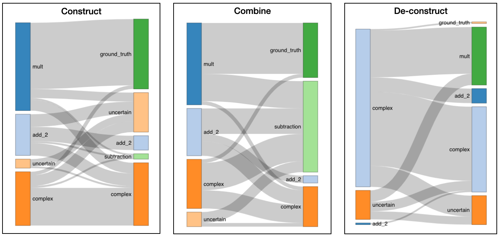
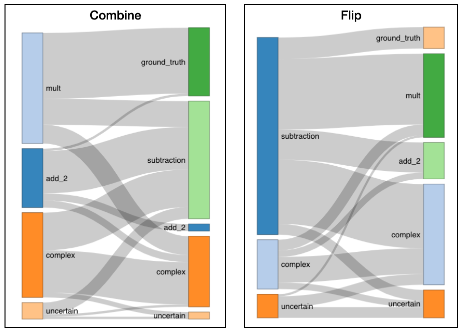

```{r setup, include=FALSE}
knitr::opts_chunk$set(echo = TRUE)
```

```{r packages, include=FALSE}
library(dplyr)
library(tidyr)
library(stringr)
library(ggplot2)
library(patchwork)
library(knitr)
library(ggridges)
library(networkD3)
```

```{r data, include=FALSE}
load('../../data/all_cleaned.Rdata')
load('../../data/all_coded.Rdata')

```


# Curriculum-order effects

Experiments 1 & 2:

* Condition _construct_: `A*B`; then `A*B-C` (varying `A`)
* Condition _de-construct_ (decon): `A*B-C`; then `A*B` (flip the two batches in _construct_)
* Condition _combine_: `A*B`; then `B-C` (keeping `A=1`)

## Generalization accuracy

```{r gen_acc, echo=FALSE, message=FALSE}
cur_acc=df.tw %>%
  filter(exp %in% c('exp_1', 'exp_2'), batch=='B') %>%
  mutate(answer=ifelse(exp=='exp_1', stripe*block-dot, dot*block-stripe)) %>%
  mutate(answer=ifelse(answer<0, 0, answer)) %>%
  mutate(correct=prediction==answer)

cur_acc %>%
  group_by(exp, condition) %>%
  summarise(acc=100*sum(correct)/n(), sd=sd(correct)) %>%
  ggplot(aes(x=exp, y=acc, fill=condition)) +
  geom_bar(stat='identity', position='dodge') +
  geom_errorbar(aes(ymin=acc-sd, ymax=acc+sd), width=.1, position=position_dodge(.9)) +
  theme_bw() +
  labs(x='', y='accuracy (%)') +
  scale_fill_manual(values=c('#88CCEE', '#6699CC', '#888888'))

exp1_gen_acc = t.test(
  cur_acc %>% filter(exp=='exp_1', condition=='construct') %>% pull(correct),
  cur_acc %>% filter(exp=='exp_1', condition=='decon') %>% pull(correct)
)

exp2_gen_acc = t.test(
  cur_acc %>% filter(exp=='exp_2', condition=='construct') %>% pull(correct),
  cur_acc %>% filter(exp=='exp_2', condition=='decon') %>% pull(correct)
)

```

For both experiments, final generalization accuracy for the _construct_ condition is significantly higher than for the _decon_ condition, both p < .001. 
These two conditions share an identical set of learning stimuli (in each experiment), only differ in the curriculum order. 
This indicates that learning benefits from an simple-to-complex curriculum.


## Conceptual bootstrapping

We collapsed experiment 1 and 2 coded self-reports, and find that in the _construct_ and _combine_ conditions people can construct compound causal relations in Phase B by reusing learned relations in Phase A.
In the _decon_ condition, however, people fail to do so (because they didn't get the chance).



## Garden-pathing


```{r mult_test, echo=FALSE}
complex_con_decon = t.test(
  labels %>% filter(exp %in% c('exp_1', 'exp_2'), condition=='construct') %>%
    mutate(is_mult=rule_cat_a=='complex') %>%
    pull(is_mult),
  labels %>% filter(exp %in% c('exp_1', 'exp_2'), condition=='decon') %>%
    mutate(is_mult=rule_cat_b=='complex') %>%
    pull(is_mult)
)

complex_com_decon = t.test(
  labels %>% filter(exp %in% c('exp_1', 'exp_2'), condition=='combine') %>%
    mutate(is_mult=rule_cat_a=='complex') %>%
    pull(is_mult),
  labels %>% filter(exp %in% c('exp_1', 'exp_2'), condition=='decon') %>%
    mutate(is_mult=rule_cat_b=='complex') %>%
    pull(is_mult)
)


```

Overwhelming information in _decon_ batch A leads people to generalize complex causal relations even after seeing a subpart of it in batch B. People in the _decon_ condition reported more complex causal relations in Phase B then both the _construct_ (p=`r round(complex_con_decon$p.value, 2)`) and _combine_ (p=`r round(complex_com_decon$p.value, 3)`) conditions.


# Subjective difficulty

Experiments 3 & 4:

* Condition _combine_: replicate this condition in Exp. 1 & 2, `A*B, B-C`
* Condition _flip_: reverse batch A and B as in condition _combine_ `B-C, A*B`

There are two compound relations consist with the data: `A*B-C` (rule_1), and `A*(B-C)` (rule_2). 
If there are no subjective difficulty differences, then in condition _combine_ people should conclude `A*B-C` and in condition _flip_ they should get `A*(B-C)`, following the order of chunking and reuse.

We looked at Phase B generalizations, and if ≥6 out of 8 predictions match rule_1 we will say this participant is following rule_1, same for rule_2, and otherwise "other". 

```{r sub_gen, echo=FALSE, message=FALSE}
dif_acc = df.tw %>%
  filter(exp %in% c('exp_3', 'exp_4'), batch=='B') %>%
  mutate(
    rule_1=ifelse(exp=='exp_3', stripe*block-dot, dot*block-stripe),
    rule_2=ifelse(exp=='exp_3', stripe*(block-dot), dot*(block-stripe)),
  ) %>%
  mutate(rule_1=ifelse(rule_1<0, 0, rule_1), rule_2=ifelse(rule_2<0, 0, rule_2)) %>%
  mutate(acc_1=prediction==rule_1, acc_2=prediction==rule_2) %>%
  group_by(exp, condition, ix) %>%
  summarise(n=n(), acc_1=sum(acc_1), acc_2=sum(acc_2)) %>%
  mutate(pred=ifelse(acc_1>=6, 'rule_1', ifelse(acc_2>=6, 'rule_2', 'other'))) 


dif_acc %>%
  ggplot(aes(x=condition, fill=pred)) +
  geom_bar(stat='count', position='fill') +
  theme_bw() +
  labs(x='', y='proportion') +
  facet_grid(~exp) +
  scale_fill_manual(values=c('#888888', '#88CCEE', '#6699CC'))

dif_acc_ttest = t.test(
  dif_acc%>%
    filter(condition=='combine') %>%
    mutate(is_rule_1=pred=='rule_1') %>%
    pull(is_rule_1),
  dif_acc%>%
    filter(condition=='flip') %>%
    mutate(is_rule_1=pred=='rule_1') %>%
    pull(is_rule_1),
)

```

Judging from generalization data, there is a predominant preference for rule_1 over rule_2.

But order still matters - more people in the _combine_ condition learned rule 1 (collapsing both experiments, p=`r round(dif_acc_ttest$p.value, 2)`).



From this plot, it is clear that `subtraction` always constitutes a higher proportion than `mult` in either phase.

We can learn two things from these results:

1. People consolidate on the evidence according to subjective difficulty of relevant causal relations. This difficulty measure can override temporal order.
2. Meanwhile, temporal order also interferes with subjective difficulties, and presenting hard things first works better than the other way around.


# Order of processing

The four experiments together revealed two order effects: 
a temporal order where previously-learned concepts can be chunked and reused to facilitate generalization,
and a difficulty order where it is preferable to add easy ones onto hard ones.

Different processing orders in our experiments appear to be either:
(1) extend batch A's guess to include batch B, 
(2) ignore batch A's info and only focus on batch B,
or (3) extend batch B's guess to also over batch A.

We already have evidence for all three types of processing orders from self-report labels,
and we can further confirm them by checking participants' generalization decisions (in case someone just reported "subtraction" but actually was thinking about a compound ground truth rule).

We can inverse phase B generalizations to the underlying causal relations one used to produce those selections (criterion: for single operators ≥7, compound rules ≥6, both out of 8), collapsing all four experiments together.


```{r check_processing_orders, echo=FALSE, message=FALSE}
df.tw %>%
  filter(batch=='B') %>%
  mutate(
    rule_1=ifelse(exp %in% c('exp_1', 'exp_3'), stripe*block-dot, dot*block-stripe),
    rule_2=ifelse(exp %in% c('exp_1', 'exp_3'), stripe*(block-dot), dot*(block-stripe)),
    sub=ifelse(exp %in% c('exp_1', 'exp_3'), block-dot, block-stripe),
    mult=ifelse(exp %in% c('exp_1', 'exp_3'), stripe*block, dot*block)
  ) %>%
  mutate(
    rule_1=ifelse(rule_1<0, 0, rule_1), rule_2=ifelse(rule_2<0, 0, rule_2),
    sub=ifelse(sub<0, 0, sub), mult=ifelse(mult<0, 0, mult)
  ) %>%
  mutate(
    is_rule_1=prediction==rule_1, is_rule_2=prediction==rule_2, 
    is_sub=prediction==sub, is_mult=prediction==mult
  ) %>%
  group_by(condition, ix) %>%
  summarise(
    n=n(), is_rule_1=sum(is_rule_1), is_rule_2=sum(is_rule_2), 
    is_sub=sum(is_sub), is_mult=sum(is_mult)
  ) %>%
  mutate(
    pred=ifelse(is_rule_1>=6, 'rule_1', 
                ifelse(is_rule_2>=6, 'rule_2', 
                       ifelse(is_sub>6, 'subtraction', 
                              ifelse(is_mult>6, 'mult', 'other'))))
  ) %>%
  mutate(
    pred=factor(pred, levels=c('rule_1', 'rule_2', 'subtraction', 'mult', 'other')),
    condition=factor(condition, levels=c('decon', 'construct', 'combine', 'flip'))
  ) %>%
  # filter(pred!='other') %>%
  ggplot(aes(x=condition, fill=pred)) +
  geom_bar(stat='count', position='fill', color='#888888', size=0.2) +
  theme_bw() +
  labs(x='', y='proportion') +
  scale_fill_manual(values=c('#6699CC', '#000000', '#DDCC77', '#CC6677', '#ffffff'))

```


In accordance with self-reports, 
for conditions other than _construct_, we observe non-negligible proportion of people focusing only on batch B's causal relationships: "mult" in _decon_ and _flip_, and "subtraction" in _combine_.

This might explain how for the _flip_ condition, rule 1 wins over rule 2:
`mult(sub(x,y),z)` has lower probability than `sub(mult(x,y),z)`, if the wrapped-inside operation share same level of chunked prob. according to our adaptor grammar model (PCFGs can't).


